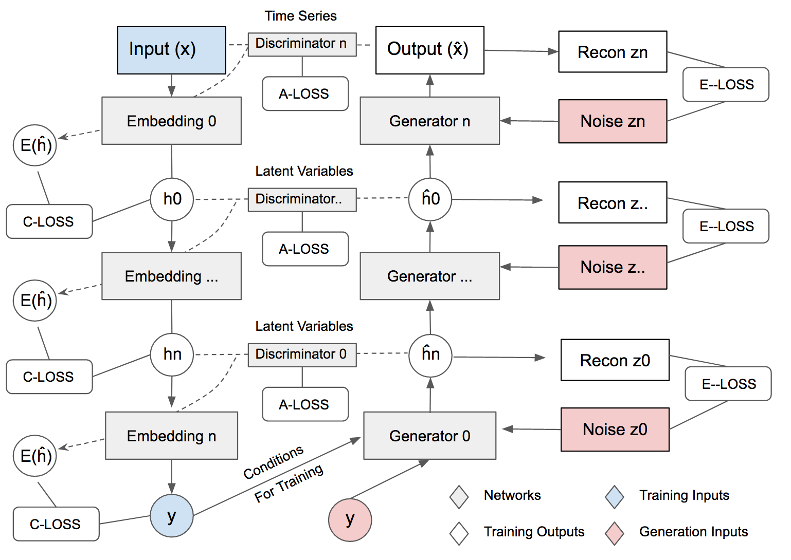
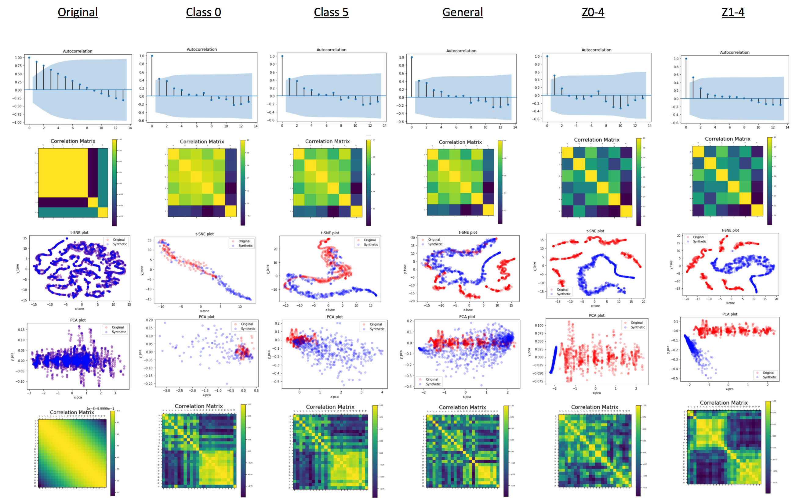
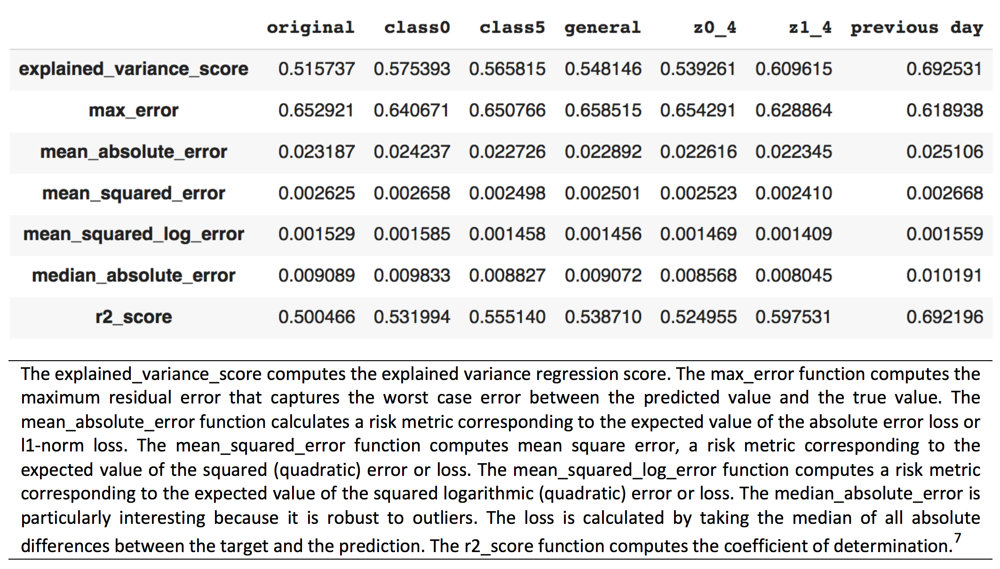

# MTSS-GAN: Multivariate Time Series Simulation Generative Adversarial Networks

The algorithm is unstable. The metrics section has two errors that I have to fix. When I get time I will get around to it.

The model has been developed on a colaboratory [notebook](https://colab.research.google.com/drive/1UFa3p4TEhK1jAPSj0KMqLpJGsgSBww_b?usp=sharing). Here I have added a few code snippets, if there is demand, I can build a package, please let me know in the issues tab. For some additional information, feel free to consult the [paper](https://papers.ssrn.com/sol3/papers.cfm?abstract_id=3616557). 

MTSS-GAN is a new generative adversarial network (GAN) developed to simulate diverse multivariate time series (MTS) data with finance applications in mind. The purpose of this synthesiser is two-fold, we both want to generate data that accurately represents the original data, while also having the flexibility to generate data with novel and unique relationships that could help with model testing and robustness checks. The method is inspired by stacked GANs originally designed for image generation. Stacked GANs have produced some of the best quality images, for that reason MTSS-GAN is expected to be a leading contender in multivariate time series generation. 

Design
---------------------



Similarity
---------------------


Utility
---------------------


Code
---------------------
Generator:
```python
def generator(inputs,
              activation='sigmoid',
              labels=None,
              codes=None):
    """

    if codes is not None:
        # generator 0 of MTSS
        inputs = [inputs, codes]
        x = concatenate(inputs, axis=1)
        # noise inputs + conditional codes
    else:
        # default input is just a noise dimension (z-code)
        x = inputs ## 

    x = Dense(SHAPE[0]*SHAPE[1])(x)
    x = Reshape((SHAPE[0], SHAPE[1]))(x)
    x = GRU(72, return_sequences=False, return_state=False,unroll=True)(x)
    x = Reshape((int(SHAPE[0]/2), 6))(x)
    x = Conv1D(128, 4, 1, "same")(x)
    x = BatchNormalization(momentum=0.8)(x) # adjusting and scaling the activations
    x = ReLU()(x)
    x = UpSampling1D()(x)
    x = Conv1D(6, 4, 1, "same")(x)
    x = BatchNormalization(momentum=0.8)(x)

    if activation is not None:
        x = Activation(activation)(x)

    # generator output is the synthesized data x
    return Model(inputs, x,  name='gen1')
```

Discriminator
```python

def discriminator(inputs,
                  activation='sigmoid',
                  num_labels=None,
                  num_codes=None):

    ints = int(SHAPE[0]/2)
    x = inputs
    x = GRU(SHAPE[1]*SHAPE[0] , return_sequences=False, return_state=False,unroll=True, activation="relu")(x)
    x = Reshape((ints, ints))(x)
    x = Conv1D(16, 3,2, "same")(x)
    x = LeakyReLU(alpha=0.2)(x)
    x = Conv1D(32, 3, 2, "same")(x)
    x = LeakyReLU(alpha=0.2)(x)
    x = Conv1D(64, 3, 2, "same")(x)
    x = LeakyReLU(alpha=0.2)(x)
    x = Conv1D(128, 3, 1, "same")(x)
    x = LeakyReLU(alpha=0.2)(x)

    x = Flatten()(x)
    # default output is probability that the time series array is real
    outputs = Dense(1)(x)

    if num_codes is not None:
        # MTSS-GAN Q0 output
        # z0_recon is reconstruction of z0 normal distribution
        # eventually two loss functions from this output.
        z0_recon =  Dense(num_codes)(x)
        z0_recon = Activation('tanh', name='z0')(z0_recon)
        outputs = [outputs, z0_recon]

    return Model(inputs, outputs, name='discriminator')
```

Encoder
```python

def build_encoder(inputs, num_labels=6, feature0_dim=6*24):

    x, feature0 = inputs

    y = GRU(SHAPE[0]*SHAPE[1], return_sequences=False, return_state=False,unroll=True)(x)
    y = Flatten()(y)
    feature0_output = Dense(feature0_dim, activation='relu')(y)
    # Encoder0 or enc0: data to feature0 
    enc0 = Model(inputs=x, outputs=feature0_output, name="encoder0")
    
    # Encoder1 or enc1
    y = Dense(num_labels)(feature0)
    labels = Activation('softmax')(y)
    # Encoder1 or enc1: feature0 to class labels 
    enc1 = Model(inputs=feature0, outputs=labels, name="encoder1")

    # return both enc0 and enc1
    return enc0, enc1
 ```

Build

```python
def build_and_train_models():
    """Load the dataset, build MTSS discriminator,
    generator, and adversarial models.
    Call the MTSS train routine.
    """

    dataX, _, _ = google_data_loading(seq_length)
    dataX = np.stack(dataX)

    train_n = int(len(dataX)*.70)
    X = dataX[:,:,:-1]
    y = dataX[:,-1,-1]
    x_train, y_train = X[:train_n,:,:], y[:train_n]
    x_test, y_test = X[train_n:,:,:], y[train_n:]

    # number of labels
    num_labels = len(np.unique(y_train))
    # to one-hot vector
    y_train = to_categorical(y_train)
    y_test = to_categorical(y_test)

    model_name = "MTSS-GAN"
    # network parameters
    batch_size = 64
    train_steps = 10
    #train_steps = 2000

    lr = 2e-4
    decay = 6e-8
    z_dim = 50 ##this is the real noise input
    z_shape = (z_dim, )
    feature0_dim = SHAPE[0]*SHAPE[1]
    feature0_shape = (feature0_dim, )
    # [1] uses Adam, but discriminator converges easily with RMSprop
    optimizer = RMSprop(lr=lr, decay=decay)

    # build discriminator 0 and Q network 0 models
    input_shape = (feature0_dim, )
    inputs = Input(shape=input_shape, name='discriminator0_input')
    dis0 = build_discriminator(inputs, z_dim=z_dim )
    #Model(Dense(SHAPE[0]*SHAPE[1]), [f0_source, z0_recon], name='dis0')

    # loss fuctions: 1) probability feature0 is real 
    # (adversarial0 loss)
    # 2) MSE z0 recon loss (Q0 network loss or entropy0 loss)
    # Because there are two outputs. 

    loss = ['binary_crossentropy', 'mse']
    loss_weights = [1.0, 1.0] 
    dis0.compile(loss=loss,
                 loss_weights=loss_weights,
                 optimizer=optimizer,
                 metrics=['accuracy'])
    dis0.summary() # feature0 discriminator, z0 estimator

    # build discriminator 1 and Q network 1 models

    input_shape = (x_train.shape[1], x_train.shape[2])
    inputs = Input(shape=input_shape, name='discriminator1_input')
    dis1 = discriminator(inputs, num_codes=z_dim)

    # loss fuctions: 1) probability time series arrays is real (adversarial1 loss)
    # 2) MSE z1 recon loss (Q1 network loss or entropy1 loss)
    loss = ['binary_crossentropy', 'mse']
    loss_weights = [1.0, 10.0] 
    dis1.compile(loss=loss,
                 loss_weights=loss_weights,
                 optimizer=optimizer,
                 metrics=['accuracy'])
    dis1.summary() # time series array discriminator, z1 estimator 


    # build generator models
    label_shape = (num_labels, )
    feature0 = Input(shape=feature0_shape, name='feature0_input')
    labels = Input(shape=label_shape, name='labels')
    z0 = Input(shape=z_shape, name="z0_input")
    z1 = Input(shape=z_shape, name="z1_input")
    latent_codes = (labels, z0, z1, feature0)
    gen0, gen1 = build_generator(latent_codes)
    # gen0: classes and noise (labels + z0) to feature0 
    gen0.summary() # (latent features generator)
    # gen1: feature0 + z0 to feature1 
    gen1.summary() # (time series array generator )

    # build encoder models
    input_shape = SHAPE
    inputs = Input(shape=input_shape, name='encoder_input')
    enc0, enc1 = build_encoder((inputs, feature0), num_labels)
     # Encoder0 or enc0: data to feature0  
    enc0.summary() # time series array to feature0 encoder
     # Encoder1 or enc1: feature0 to class labels
    enc1.summary() # feature0 to labels encoder (classifier)
    encoder = Model(inputs, enc1(enc0(inputs)))
    encoder.summary() # time series array to labels encoder (classifier)

    data = (x_train, y_train), (x_test, y_test)
    print(x_train.shape)
    print(y_train.shape)

    # this process would train enco, enc1, and encoder
    train_encoder(encoder, data, model_name=model_name)


    # build adversarial0 model = 
    # generator0 + discriminator0 + encoder1
    # encoder0 weights frozen
    enc1.trainable = False
    # discriminator0 weights frozen
    dis0.trainable = False
    gen0_inputs = [labels, z0]
    gen0_outputs = gen0(gen0_inputs)
    adv0_outputs = dis0(gen0_outputs) + [enc1(gen0_outputs)]
    # labels + z0 to prob labels are real + z0 recon + feature1 recon
    adv0 = Model(gen0_inputs, adv0_outputs, name="adv0")
    # loss functions: 1) prob labels are real (adversarial1 loss)
    # 2) Q network 0 loss (entropy0 loss)
    # 3) conditional0 loss (classifier error)
    loss_weights = [1.0, 1.0, 1.0] 
    loss = ['binary_crossentropy', 
            'mse',
            'categorical_crossentropy']
    adv0.compile(loss=loss,
                 loss_weights=loss_weights,
                 optimizer=optimizer,
                 metrics=['accuracy'])
    adv0.summary()

    # build adversarial1 model =
    # generator1 + discriminator1 + encoder0
    optimizer = RMSprop(lr=lr*0.5, decay=decay*0.5)
    # encoder1 weights frozen
    enc0.trainable = False
    # discriminator1 weights frozen
    dis1.trainable = False
    gen1_inputs = [feature0, z1]
    gen1_outputs = gen1(gen1_inputs)
    print(gen1_inputs)
    print(gen1_outputs)
    adv1_outputs = dis1(gen1_outputs) + [enc0(gen1_outputs)]
    # feature1 + z1 to prob feature1 is 
    # real + z1 recon + feature1/time series array recon
    adv1 = Model(gen1_inputs, adv1_outputs, name="adv1")
    # loss functions: 1) prob feature1 is real (adversarial0 loss)
    # 2) Q network 1 loss (entropy1 loss)
    # 3) conditional1 loss
    loss = ['binary_crossentropy', 'mse', 'mse']
    loss_weights = [1.0, 10.0, 1.0] 
    adv1.compile(loss=loss,
                 loss_weights=loss_weights,
                 optimizer=optimizer,
                 metrics=['accuracy'])
    adv1.summary()

    

    # train discriminator and adversarial networks
    models = (enc0, enc1, gen0, gen1, dis0, dis1, adv0, adv1)
    params = (batch_size, train_steps, num_labels, z_dim, model_name)
    gen0, gen1 = train(models, data, params)


    return gen0, gen1
```


Training
```python

def train(models, data, params):

    enc0, enc1, gen0, gen1, dis0, dis1, adv0, adv1 = models
    # network parameters
    batch_size, train_steps, num_labels, z_dim, model_name = params
    # train dataset
    (x_train, y_train), (_, _) = data # I can do this. 
    # the generated time series array is saved every 500 steps
    save_interval = 500

    # label and noise codes for generator testing
    z0 = np.random.normal(scale=0.5, size=[SHAPE[0], z_dim])
    z1 = np.random.normal(scale=0.5, size=[SHAPE[0], z_dim])
    noise_class = np.eye(num_labels)[np.arange(0, SHAPE[0]) % num_labels]
    noise_params = [noise_class, z0, z1]
    # number of elements in train dataset
    train_size = x_train.shape[0]
    print(model_name,
          "Labels for generated time series arrays: ",
          np.argmax(noise_class, axis=1))

    tv_plot = tv.train.PlotMetrics(columns=5, wait_num=5)
    for i in range(train_steps):
        # train the discriminator1 for 1 batch
        # 1 batch of real (label=1.0) and fake feature1 (label=0.0)
        # randomly pick real time series arrays from dataset
        dicta = {}
        rand_indexes = np.random.randint(0, 
                                         train_size, 
                                         size=batch_size)
        real_samples = x_train[rand_indexes]
        # real feature1 from encoder0 output
        real_feature0 = enc0.predict(real_samples)
        # generate random 50-dim z1 latent code
        real_z0 = np.random.normal(scale=0.5,
                                   size=[batch_size, z_dim])
        # real labels from dataset
        real_labels = y_train[rand_indexes]

        # generate fake feature1 using generator1 from
        # real labels and 50-dim z1 latent code
        fake_z0 = np.random.normal(scale=0.5,
                                   size=[batch_size, z_dim])
        fake_feature0 = gen0.predict([real_labels, fake_z0])

        # real + fake data
        feature0 = np.concatenate((real_feature0, fake_feature0))
        z0 = np.concatenate((fake_z0, fake_z0))

        # label 1st half as real and 2nd half as fake
        y = np.ones([2 * batch_size, 1])
        y[batch_size:, :] = 0

        # train discriminator1 to classify feature1 as 
        # real/fake and recover
        # latent code (z0). real = from encoder1, 
        # fake = from genenerator10
        # joint training using discriminator part of 
        # advserial1 loss and entropy0 loss
        metrics = dis0.train_on_batch(feature0, [y, z0])
        # log the overall loss only
        log = "%d: [dis0_loss: %f]" % (i, metrics[0])
        dicta["dis0_loss"] = metrics[0]
         
        # train the discriminator1 for 1 batch
        # 1 batch of real (label=1.0) and fake time series arrays (label=0.0)
        # generate random 50-dim z1 latent code
        fake_z1 = np.random.normal(scale=0.5, size=[batch_size, z_dim])
        # generate fake time series arrays from real feature1 and fake z1
        fake_samples = gen1.predict([real_feature0, fake_z1])
       
        # real + fake data
        x = np.concatenate((real_samples, fake_samples))
        z1 = np.concatenate((fake_z1, fake_z1))

        # train discriminator1 to classify time series arrays 
        # as real/fake and recover latent code (z1)
        # joint training using discriminator part of advserial0 loss
        # and entropy1 loss
        metrics = dis1.train_on_batch(x, [y, z1])
        # log the overall loss only (use dis1.metrics_names)
        log = "%s [dis1_loss: %f]" % (log, metrics[0])
        dicta["dis1_loss"] = metrics[0]

        # adversarial training 
        # generate fake z0, labels
        fake_z0 = np.random.normal(scale=0.5, 
                                   size=[batch_size, z_dim])
        # input to generator0 is sampling fr real labels and
        # 50-dim z0 latent code
        gen0_inputs = [real_labels, fake_z0]

        # label fake feature0 as real (specifies whether real or not)
        # is it bypassing the discriminator?
        y = np.ones([batch_size, 1])
    
        # train generator0 (thru adversarial) by fooling 
        # the discriminator
        # and approximating encoder1 feature0 generator
        # joint training: adversarial0, entropy0, conditional0
        metrics = adv0.train_on_batch(gen0_inputs,
                                      [y, fake_z0, real_labels])
        fmt = "%s [adv0_loss: %f, enc1_acc: %f]"
        dicta["adv0_loss"] = metrics[0]
        dicta["enc1_acc"] = metrics[6]

        # log the overall loss and classification accuracy
        log = fmt % (log, metrics[0], metrics[6])

        # input to generator0 is real feature0 and 
        # 50-dim z0 latent code
        fake_z1 = np.random.normal(scale=0.5,
                                   size=[batch_size, z_dim])
        
        gen1_inputs = [real_feature0, fake_z1]

        # train generator1 (thru adversarial) by fooling 
        # the discriminator and approximating encoder1 time series arrays 
        # source generator joint training: 
        # adversarial1, entropy1, conditional1
        metrics = adv1.train_on_batch(gen1_inputs,
                                      [y, fake_z1, real_feature0])
        # log the overall loss only
        log = "%s [adv1_loss: %f]" % (log, metrics[0])
        dicta["adv1_loss"] = metrics[0]


        print(log)
        if (i + 1) % save_interval == 0:
            generators = (gen0, gen1)
            plot_ts(generators,
                        noise_params=noise_params,
                        show=False,
                        step=(i + 1),
                        model_name=model_name)
            
        tv_plot.update({'dis0_loss': dicta["dis0_loss"], 'dis1_loss': dicta["dis1_loss"], 'adv0_loss': dicta["adv0_loss"], 'enc1_acc': dicta["enc1_acc"], 'adv1_loss': dicta["adv1_loss"]})
        tv_plot.draw()

    # save the modelis after training generator0 & 1
    # the trained generator can be reloaded for
    # future data generation
    gen0.save(model_name + "-gen1.h5")
    gen1.save(model_name + "-gen0.h5")

    return  gen0, gen1 
    
```

